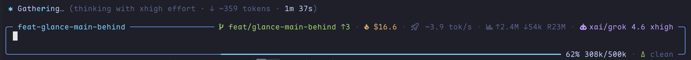
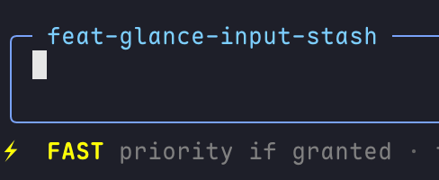
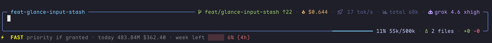
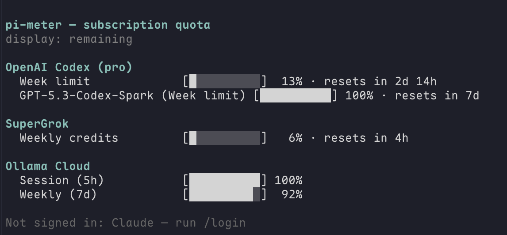

# pi-extensions

[简体中文](./README.zh-CN.md)

A collection of Pi extensions by zhcsyncer.

## Packages

- [`@zhcsyncer/pi-recap`](./packages/pi-recap) — recent activity recap extension with optional session title and nearest-layer Herdr pane or tmux window naming.
- [`@zhcsyncer/pi-tool-display-intent`](./packages/pi-tool-display-intent) — compact tool rendering with model-written intent phrases, RPC-visible summaries, an optional all-tool per-request Tools summary, stable `done` rows, adaptive diffs, and bounded Bash call previews.

  

  

  

- [`@zhcsyncer/pi-todo`](./packages/pi-todo) — cycle-bounded task overlay with atomic multi-item batches, confirmed `/todo` reset, and no dependency graph; live lists stay on active work across compaction and resume.
- [`@zhcsyncer/pi-glance`](./packages/pi-glance) — maintained `pi-glance` fork with composable statuses, a single-slot editor stash, working-tree counts in the Git status line or bottom-right border, `/diff` review, and a theme-aware Claude-inspired working indicator.

  

- [`@zhcsyncer/pi-plan-mode`](./packages/pi-plan-mode) — strict read-only planning with revdiff review, immutable revisions, compact audit rendering, and an explicit branch-aware implementation/completion lifecycle.
- [`@zhcsyncer/pi-search-hub`](./packages/pi-search-hub) — bundle-private `web_search` and `web_read` tools integrated with intent-aware rendering.
- [`@zhcsyncer/pi-context7`](./packages/pi-context7) — Context7 `resolve-library-id` / `query-docs` tools with compact self-contained TUI rendering and the full `context7-docs` skill.
- [`@zhcsyncer/pi-ask-user-question`](./packages/pi-ask-user-question) — structured clarification questions with a non-overlay layout, context-aware number-key selection, centered previews, and readable post-interaction results.
- [`@zhcsyncer/pi-subagents`](./packages/pi-subagents) — maintained fork of `@tintinweb/pi-subagents` with a brief ConversationViewer and collapsible tool TUI (model/effort chips). Also embedded in the root bundle.
- [`@zhcsyncer/pi-fast-mode`](./packages/pi-fast-mode) — same-model Fast / Priority scheduling for OpenAI and xAI, with an in-memory `/fast` and Ctrl+F switch.

  

- [`@zhcsyncer/pi-meter`](./packages/pi-meter) — local spend plus Claude / Codex / SuperGrok / Ollama Cloud remaining in one `/usage` command. Combines `pi-tracker` and `@pi-plugins/usage`; disable the latter because both register `/usage`.

  

  

## Notes

Search Hub ships only in the root bundle. Do not load `@tintinweb/pi-subagents` with `pi-subagents`, or `@pi-plugins/usage` with `pi-meter`.

## Install from Git

Install the whole extension bundle from this repository:

```bash
pi install git:github.com/zhcsyncer/pi-extensions
```

Try without installing:

```bash
pi -e git:github.com/zhcsyncer/pi-extensions
```

## Install from npm

Install the complete bundle, including Glance, Plan Mode, Context7, Subagents, Fast Mode, Meter, structured user questions, and the private Search Hub fork:

```bash
pi install npm:@zhcsyncer/pi-extensions
```

Install only recap:

```bash
pi install npm:@zhcsyncer/pi-recap
```

Install only the intent-aware tool display:

```bash
pi install npm:@zhcsyncer/pi-tool-display-intent
```

Install only Todo:

```bash
pi install npm:@zhcsyncer/pi-todo
```

Install only Glance:

```bash
pi install npm:@zhcsyncer/pi-glance
```

Install only strict Plan Mode:

```bash
pi install npm:@zhcsyncer/pi-plan-mode
```

Install only Context7 documentation tools:

```bash
pi install npm:@zhcsyncer/pi-context7
```

Install only structured user questions:

```bash
pi install npm:@zhcsyncer/pi-ask-user-question
```

Install only Subagents:

```bash
pi install npm:@zhcsyncer/pi-subagents
```

Install only Fast Mode:

```bash
pi install npm:@zhcsyncer/pi-fast-mode
```

Install only Meter:

```bash
pi install npm:@zhcsyncer/pi-meter
```

## Releasing

Add a changeset to each user-facing pull request:

```bash
pnpm changeset
```

Public packages version independently. A changed child package must include the aggregate root package in the same release plan because the root tarball embeds child sources; unchanged siblings do not release. Before pushing a release-bearing change, present the planned packages and target versions for user review. After approved changes land on `main`, GitHub Actions opens a version PR, and merging that reviewed PR publishes the planned packages and creates their GitHub Releases. See [RELEASING.md](./RELEASING.md) for the complete workflow and one-time npm/GitHub setup.

## License

MIT

`pi-tool-display-intent` is a modified fork of MIT-licensed [`MasuRii/pi-tool-display`](https://github.com/MasuRii/pi-tool-display) 0.5.0 and adapts the MIT-licensed `displaySummary` mechanism from [`mertdeveci5/pi-tool-display-summary`](https://github.com/mertdeveci5/pi-tool-display-summary) 0.1.0. Full attribution and preserved notices are in [`packages/pi-tool-display-intent/README.md`](./packages/pi-tool-display-intent/README.md), [`LICENSE`](./packages/pi-tool-display-intent/LICENSE), and [`UPSTREAM_LICENSE`](./packages/pi-tool-display-intent/UPSTREAM_LICENSE).

`pi-todo` is forked from MIT-licensed [`@juicesharp/rpiv-todo`](https://github.com/juicesharp/rpiv-mono/tree/main/packages/rpiv-todo) 1.20.0. The exact revision and preserved notices are recorded in [`packages/pi-todo/UPSTREAM_SOURCE.md`](./packages/pi-todo/UPSTREAM_SOURCE.md), [`LICENSE`](./packages/pi-todo/LICENSE), and [`UPSTREAM_LICENSE`](./packages/pi-todo/UPSTREAM_LICENSE).

`pi-glance` is forked from MIT-licensed [`LinYS77/pi-glance`](https://github.com/LinYS77/pi-glance) 0.5.3. The exact revision and preserved notices are recorded in [`packages/pi-glance/UPSTREAM_SOURCE.md`](./packages/pi-glance/UPSTREAM_SOURCE.md), [`LICENSE`](./packages/pi-glance/LICENSE), and [`UPSTREAM_LICENSE`](./packages/pi-glance/UPSTREAM_LICENSE).

`pi-search-hub` is forked from [`ronnieops/pi-search-hub`](https://github.com/ronnieops/pi-search-hub) 2.8.0, whose package metadata and README declare MIT. Its exact revision and preserved notices are recorded in [`packages/pi-search-hub/UPSTREAM_SOURCE.md`](./packages/pi-search-hub/UPSTREAM_SOURCE.md) and [`UPSTREAM_NOTICE.md`](./packages/pi-search-hub/UPSTREAM_NOTICE.md).

`pi-context7` is forked from MIT-licensed [`@upstash/context7-pi`](https://github.com/upstash/context7) 0.1.2 (`b250c2515694eee4b6df4db82fa056df9ed3e306`). The exact revision and preserved notices are recorded in [`packages/pi-context7/UPSTREAM_SOURCE.md`](./packages/pi-context7/UPSTREAM_SOURCE.md), [`LICENSE`](./packages/pi-context7/LICENSE), and [`UPSTREAM_LICENSE`](./packages/pi-context7/UPSTREAM_LICENSE).

`pi-ask-user-question` is forked from MIT-licensed [`@juicesharp/rpiv-ask-user-question`](https://github.com/juicesharp/rpiv-mono/tree/main/packages/rpiv-ask-user-question) 2.4.0. The exact revision and preserved notices are recorded in [`packages/pi-ask-user-question/UPSTREAM_SOURCE.md`](./packages/pi-ask-user-question/UPSTREAM_SOURCE.md), [`LICENSE`](./packages/pi-ask-user-question/LICENSE), and [`UPSTREAM_LICENSE`](./packages/pi-ask-user-question/UPSTREAM_LICENSE).

`pi-subagents` is forked from MIT-licensed [`@tintinweb/pi-subagents`](https://github.com/tintinweb/pi-subagents) 0.14.3 (`c10b1836256e760da75296ccd4e57a77ada1325e`). The exact revision, local UI deltas, and preserved notices are recorded in [`packages/pi-subagents/UPSTREAM_SOURCE.md`](./packages/pi-subagents/UPSTREAM_SOURCE.md), [`LICENSE`](./packages/pi-subagents/LICENSE), and [`UPSTREAM_LICENSE`](./packages/pi-subagents/UPSTREAM_LICENSE).
